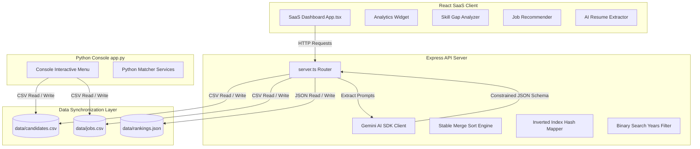

# RankedIn: System Documentation & Technical Specification

Welcome to the technical documentation for **RankedIn**, built for the **Samsung Innovation Campus (SIC) Hackathon**. 

This document details the system design, algorithmic implementations, file structure, API endpoints, and visual guide for the RankedIn matching and ranking engine.

---

## 👥 Hackathon Team Members
* **Sushil Kumar Mishra**
* **Achintya Dwivedi**
* **Gautam Prasad Upadhyay**

---

## 🎬 Application Visual Demo
Below is a full recording showcasing the premium React SaaS dashboard in action:

---

## 🏛️ System Architecture

RankedIn is built using a unified full-stack architecture that supports both a web-based dashboard interface and an interactive Python terminal console.

---

## 🧮 Vetting Mathematics & Scoring
Candidates are scored against specific job criteria using a weighted utility function:

1. **Skills Alignment (70%):**  
   $$\text{Skills Contribution} = \left( \frac{\text{Skills Matched}}{\text{Required Skills}} \right) \times 70.0$$
2. **Experience Suitability (20%):**  
   $$\text{Experience Contribution} = \min\left(1.0, \frac{\text{Candidate Experience}}{\text{Job Min Experience}}\right) \times 20.0$$
3. **Education Alignment (10%):**  
   Education is mapped to numeric weight ranks:
   - `PhD` / `Doctor` = 4, `Master` = 3, `Bachelor` = 2, `High School` = 1, `None` = 0
   - If $\text{Candidate Level} \ge \text{Preferred Level}$, score is **10.0**.
   - If $\text{Candidate Level} = \text{Preferred Level} - 1$, score is **5.0**.
   - Otherwise, **0.0**.

---

## 🧬 Manual Algorithms & Data Structures

RankedIn bypasses high-level library functions in favor of raw algorithmic implementations to showcase computational depth:

### 1. Stable Merge Sort ($O(N \log N)$)
* **Goal**: Sort candidate profiles deterministically according to their final match scores.
* **Why Merge Sort**: Native sort algorithms can be unstable. Merge Sort guarantees a **stable sort** (preserving the relative order of candidates with identical scores), which is critical for fair, deterministic ranking boards.
* **Complexity**: Worst-case and average-case time complexity of $O(N \log N)$.

### 2. Inverted Index Hash Map ($O(1)$)
* **Goal**: Retrieve candidates matching specific technical skills in sub-linear time.
* **Mechanism**: On demand, the engine builds an inverted index map where keys are specific technical skills (e.g., `Python`, `Docker`) and values are a `Set` of candidate IDs possessing that skill.
* **Complexity**: Provides average-case $O(1)$ lookups for talent pool filtering.

### 3. Binary Search Years Filter ($O(\log N)$)
* **Goal**: Find candidate experience lower bounds quickly.
* **Mechanism**: Candidate subsets are sorted by years of experience. A binary search boundary algorithm finds the first index matching the experience threshold.
* **Complexity**: Restricts the search space logarithmically at $O(\log N)$ time.

---

## 🔌 API Endpoints Reference

All requests and responses use standard JSON payloads.

| Method | Endpoint | Description |
| :--- | :--- | :--- |
| **GET** | `/api/candidates` | Fetches the current list of candidate profiles parsed from the CSV database. |
| **POST** | `/api/candidates` | Adds a new candidate profile manually. Saves to `data/candidates.csv`. |
| **GET** | `/api/jobs` | Fetches all active job opening criteria. |
| **POST** | `/api/jobs` | Adds a new job opening requirement. Saves to `data/jobs.csv`. |
| **GET** | `/api/match` | Returns a detailed, itemized match evaluation between a specific candidate and job ID. |
| **GET** | `/api/rank` | Employs the stable **Merge Sort** algorithm to rank all candidates for a job and saves the board to `data/rankings.json`. |
| **GET** | `/api/search` | Performs logarithmic experience filtering and **Inverted Index Hashing** search. |
| **GET** | `/api/analytics` | Computes statistical metrics (experience distributions, popular skills, certifications). |
| **POST**| `/api/parse-resume` | Extracts resume profiles from text using **Gemini-3.5-flash** or heuristic regex fallback. |
| **GET** | `/api/skill-gap` | Yields missing technologies and recommended upskilling paths. |
| **GET** | `/api/recommender` | Ranks all jobs in the database for a single candidate based on suitability. |
| **GET** | `/api/resume-score`| Grades the structure, experience depth, and skill diversity of a resume profile. |
